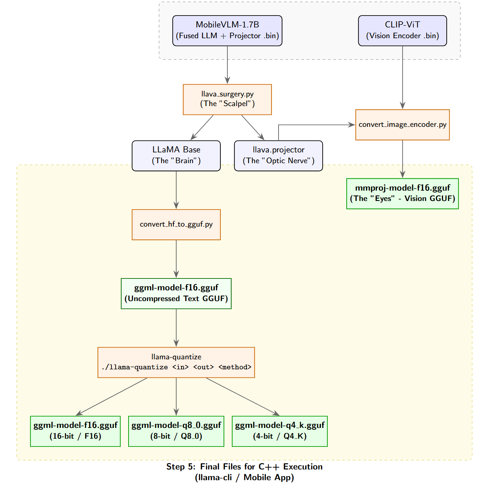
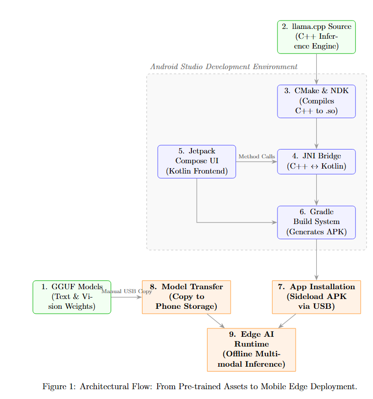
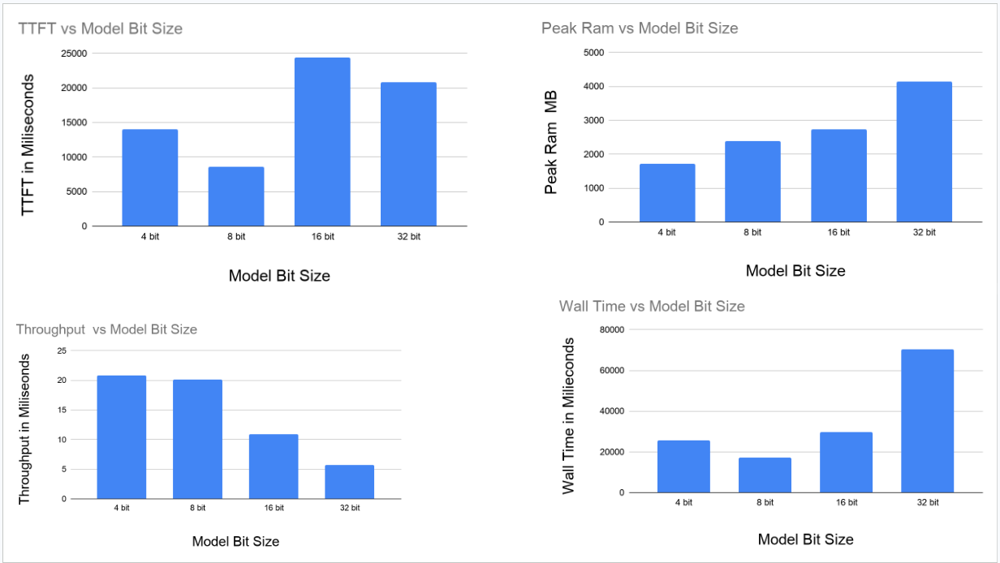

# Offline Multimodal AI for Real-Time Banana Disease Diagnostics 🍌📱

BananaApp is a privacy-preserving, fully offline Android application that leverages state-of-the-art quantized Vision-Language Models (VLMs) to diagnose banana plant diseases directly on consumer mobile hardware. 

By running optimized, multimodal inference locally on the device edge, this tool assists farmers and agricultural researchers in identifying diseases (e.g., Black Sigatoka, Panama) without requiring cloud compute or an active internet connection.

## 🚀 Key Features
* **Fully Offline Inference:** No data leaves the device. All image processing and text generation happen locally.
* **Multimodal Architecture:** Combines a CLIP Vision Transformer (ViT) for visual feature extraction with an LLM for conversational diagnostics.
* **Memory Optimization:** Utilizes 4-bit, 8-bit and 16-bit quantization for the text model and FP16 for the vision projector, leveraging memory mapping (`mmap`) to prevent Out-Of-Memory (OOM) crashes on mobile RAM.
* **Continuous Chat Memory:** Supports multi-turn conversations, allowing users to ask follow-up questions about treatments and symptoms.
* **Modern Android UI:** Built with Jetpack Compose for a reactive, smooth, and asynchronous user experience while the C++ backend runs at full capacity.

## 📂 Project Structure
Based on the root directory, the project is organized into the following modules:

* **`/Mobile App`**: The core Android Studio project containing the Jetpack Compose UI, Kotlin ViewModels, and the C++ JNI bridge (`llama-android.cpp`) that connects the Android OS to the AI engine.
* **`/Mobile models`**: The storage directory for the compiled, quantized model files (e.g., the `.gguf` text models and the `mmproj-model-f16.gguf` vision projector) ready to be pushed to the mobile device.
* **`/MobileVLM`**: Contains the integration of the MobileVLM architecture, acting as the baseline multimodal framework for efficient mobile inference.
* **`/Quantization`**: The pipeline used to compress the massive neural network weights into mobile-friendly formats using `llama.cpp` tools.
* **`/Train Data`**: The datasets of banana leaf imagery used for evaluating, benchmarking, and testing the vision projector's accuracy.
* **`/outputs`**: Directory containing files and artifacts related to the trained VLM.

## 📥 Installation & Usage Guide

🎥 **Video Demonstration:** [Watch the App Demo on Google Drive](https://drive.google.com/file/d/1vPxUAFgPNuGc1rdw3BlWBAu88onR2-Be/view?usp=sharing)

### 1. Download and Install the App
The compiled Android application (APK) is located in the **`/Mobile App/app/build/outputs/apk/debug`** directory. 
- Download the `app-debug.apk` file from this folder to your Android device.
- Open the file on your device and follow the prompts to install it (you may need to enable "Install from unknown sources" in your Android settings).

### 2. Setup the AI Models
To run the application offline, you need to transfer the quantized model files to your device:
- Download all **five** required model files from this [Google Drive Link](https://drive.google.com/drive/folders/1NoRujnl83h4Ups0BOmK1yWlj_jTn-_8F) (due to large file sizes, they are not hosted directly in the repository).
- Using a file manager or by connecting your phone to a PC, you **must** create the following specific folder on your device's internal storage: `Download/BananaVLM_Models`
- Copy all five downloaded model files into this exact folder (`Download/BananaVLM_Models`) on your Android device. The app requires the models to be placed in this specific location.

### 3. Running the App & Selecting Models
- Open **BananaApp** on your Android device.
- In the app, navigate to the **Model Selection** interface.
- Use the file picker to navigate to the folder where you placed the model files and select them.
- Once the models are loaded into memory, you can capture a photo of a banana leaf or choose one from your gallery.
- Ask the AI questions about the image and receive real-time, offline diagnostics!

  
  

## 🧪 Steps to Reproduce
If you wish to reproduce the environment, quantization pipeline, and application build from scratch:
1. Install all necessary dependencies by running `pip install -r requirements.txt` from the main project folder.
2. For an in-depth, detailed guide encompassing the full workflow, please refer to the instructions provided in the **`report.md`** file.

## 🛠️ Core Technologies & Acknowledgments

This project is built on the shoulders of incredible open-source AI repositories. A massive thanks to the following projects which act as the engine for BananaApp:

1. **[ggml-org/llama.cpp](https://github.com/ggml-org/llama.cpp)** 
   * *Usage:* Found in the `/Quantization` folder and integrated via the NDK. This provides the core C++ inference engine, allowing us to run massive LLMs on ARM-based mobile processors using GGUF quantization formats.
2. **[Meituan-AutoML/MobileVLM](https://github.com/Meituan-AutoML/MobileVLM)** 
   * *Usage:* Found in the `/MobileVLM` folder. This repository provides the highly efficient vision-language architecture designed specifically for resource-constrained edge devices, seamlessly linking the CLIP vision encoder with the language model.
3. **Model Training:** A huge acknowledgment to **Arun** for his indispensable efforts and expertise in training the base models powering this project.
4. **Google Gemini:** Gemini was utilized as an AI coding assistant to accelerate the development of the Android mobile application and streamline the intricate C++/Kotlin integration.

## 🧠 How It Works Under the Hood

1. **Image Capture:** The user captures a photo of a diseased leaf.
2. **Vision Encoding:** The FP16 CLIP projector translates the image patches into mathematical vector embeddings.
3. **Prompt Injection:** The Jetpack Compose UI concatenates the conversational history and injects the visual embeddings into the prompt.
4. **C++ Inference:** The prompt crosses the JNI bridge into the `llama.cpp` engine.
5. **Streaming Response:** The quantized LLM calculates the response and streams tokens back to the Kotlin Coroutine asynchronously, updating the UI in real-time.

## 🗜️ Model Quantization & Conversion Pipeline

The diagram above illustrates the step-by-step process of converting the heavy PyTorch models into the lightweight GGUF format required for mobile inference:
1. **Model Splitting:** The original MobileVLM model is run through a surgery script (`llava_surgery.py`) to separate the base LLaMA text model from the vision projector.
2. **Vision Conversion:** The CLIP-ViT encoder and the separated projector are converted together into a 16-bit GGUF vision model (`mmproj-model-f16.gguf`).
3. **Text Conversion & Quantization:** The LLaMA base model is first converted to an uncompressed 32-bit GGUF file. Then, using `llama-quantize`, it is compressed into highly optimized 4-bit (Q4_K), 8-bit (Q8_0)  and 16-bit (F16) formats to fit seamlessly into the limited memory of edge devices.

## ⚙️ Architectural Deployment Flow

The diagram above illustrates the end-to-end architectural pipeline required to deploy the multimodal BananaVLM system onto a mobile edge device. Due to the strict file size limitations of standard Android applications, the deployment process is divided into two distinct, parallel pathways:

**1. The Software Build Pipeline (Vertical Flow)**  
The core application logic is constructed within the Android Studio environment. The `llama.cpp` inference engine acts as the foundational backend. To integrate this with the mobile operating system, the Android Native Development Kit (NDK) and CMake are utilized to cross-compile the C++ source code into an ARM64-compatible shared library (`.so`). A Java Native Interface (JNI) bridge is then established to expose these low-level memory operations to the Kotlin-based Jetpack Compose frontend. Finally, the Gradle build system packages the compiled native libraries and user interface into a lightweight Android Package Kit (APK), which is sideloaded onto the target device via USB debugging.

**2. The Model Asset Pipeline (Horizontal Flow)**  
Because the pre-trained neural network weights (GGUF formats for text and the `mmproj` vision projector) are several gigabytes in size, they must bypass the standard APK build process. These raw models are manually transferred directly into the physical device's internal storage file system. 

**3. Edge AI Runtime**  
At runtime, the installed application requests local storage permissions to locate the manually transferred GGUF weights. The JNI bridge loads these weights directly into the device's RAM, enabling the mobile processor to execute completely offline, multimodal diagnostics without relying on cloud infrastructure.

## 📱 Edge AI Compression & Performance Metrics

To enable fully offline inference on resource-constrained mobile hardware, aggressive quantization techniques were applied to the base models. By converting the neural network weights from standard 32-bit floating-point to lower-precision formats, we drastically reduced the memory footprint while maintaining the mathematical integrity required for accurate visual diagnostics.

### 1. Payload Compression Ratios
The following table outlines the total model payload size on the device (incorporating the 595 MB vision backbone alongside the quantized text models) and the resulting effective compression ratios:

| Model Version | Total Payload (Backbone + Text) | Calculation | Effective Compression Ratio |
| :--- | :--- | :--- | :--- |
| **Base (32-bit)** | 6186.04 MB | - | **1.00x** (Baseline) |
| **16-bit (F16)** | 3390.52 MB | 6186.04 / 3390.52 | **1.82x** |
| **8-bit (Q8_0)** | 2079.80 MB | 6186.04 / 2079.80 | **2.97x** |
| **4-bit (Q4_K)** | 1429.00 MB | 6186.04 / 1429.00 | **4.33x** |

### 2. On-Device Inference Profiling
To evaluate the real-world viability of this Edge AI architecture, the quantized models were benchmarked directly on mobile hardware. 

As demonstrated in the profiling charts above, the quantization pipeline yields critical advantages for edge computing:
* **Peak RAM Requirements:** The 4-bit model successfully suppresses peak RAM usage to under 2000 MB. This is essential for mobile deployment, preventing the Android OS from triggering an Out-Of-Memory (OOM) kill, which is inevitable with the >4000 MB requirement of the uncompressed 32-bit model.
* **Throughput & Latency:** Lower-precision formats (specifically 4-bit and 8-bit) demonstrate vastly superior throughput and drastically reduced total Wall Time. This acceleration is what allows the app to stream diagnostic text to the user in real-time without severe lag. 

## 👨‍💻 Authors
* **Ritik Kumar Badiya**
* **Devendra Umbrajkar**
* **Vikash Singh**

*This project was developed as part of the [Edge AI (2026)](https://www.samy101.com/edge-ai-26/) course.*