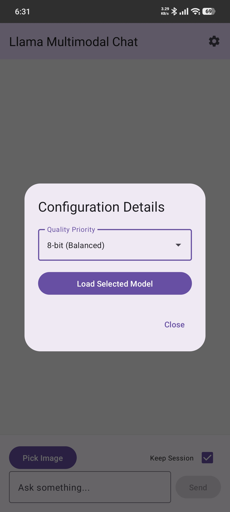
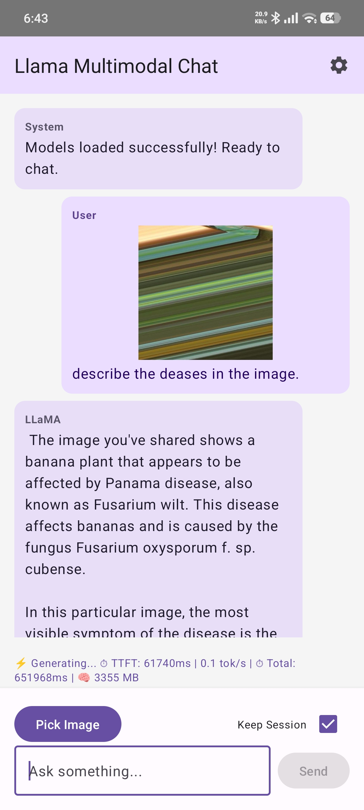

# Offline Multimodal AI for Real-Time Banana Disease Diagnostics 🍌📱

BananaApp is a privacy-preserving, fully offline Android application that leverages state-of-the-art quantized Vision-Language Models (VLMs) to diagnose banana plant diseases directly on consumer mobile hardware. 

By running optimized, multimodal inference locally on the device edge, this tool assists farmers and agricultural researchers in identifying diseases (e.g., Black Sigatoka, Panama Wilt) without requiring cloud compute or an active internet connection.

## 🚀 Key Features
* **Fully Offline Inference:** No data leaves the device. All image processing and text generation happen locally.
* **Multimodal Architecture:** Combines a Vision Transformer (ViT) for visual feature extraction with an LLM for conversational diagnostics.
* **Memory Optimization:** Utilizes 4-bit/8-bit quantization for the text model and FP16 for the vision projector, leveraging memory mapping (`mmap`) to prevent Out-Of-Memory (OOM) crashes on mobile RAM.
* **Continuous Chat Memory:** Supports multi-turn conversations, allowing users to ask follow-up questions about treatments and symptoms.
* **Modern Android UI:** Built with Jetpack Compose for a reactive, smooth, and asynchronous user experience while the C++ backend runs at full capacity.

## 📂 Project Structure
Based on the root directory, the project is organized into the following modules:

* **`/Mobile App`**: The core Android Studio project containing the Jetpack Compose UI, Kotlin ViewModels, and the C++ JNI bridge (`llama-android.cpp`) that connects the Android OS to the AI engine.
* **`/Mobile models`**: The storage directory for the compiled, quantized model files (e.g., the `.gguf` text models and the `mmproj-model-f16.gguf` vision projector) ready to be pushed to the mobile device.
* **`/MobileVLM`**: Contains the integration of the MobileVLM architecture, acting as the baseline multimodal framework for efficient mobile inference.
* **`/Quantization`**: The pipeline used to compress the massive neural network weights into mobile-friendly formats using `llama.cpp` tools.
* **`/Train Data`**: The datasets of banana leaf imagery used for evaluating, benchmarking, and testing the vision projector's accuracy.
* **`/outputs`**: Directory containing files and artifacts related to the trained VLM.

## 📥 Installation & Usage Guide

### 1. Download and Install the App
The compiled Android application (APK) is located in the **`/Mobile App/app/build/outputs/apk/debug`** directory. 
- Download the `app-debug.apk` file from this folder to your Android device.
- Open the file on your device and follow the prompts to install it (you may need to enable "Install from unknown sources" in your Android settings).

### 2. Setup the AI Models
To run the application offline, you need to transfer the quantized model files to your device:
- Download all **five** required model files from the **`/Mobile models`** folder in this repository.
- Using a file manager or by connecting your phone to a PC, you **must** create the following specific folder on your device's internal storage: `Download/BananaVLM_Models`
- Copy all five downloaded model files into this exact folder (`Download/BananaVLM_Models`) on your Android device. The app requires the models to be placed in this specific location.

### 3. Running the App & Selecting Models
- Open **BananaApp** on your Android device.
- In the app, navigate to the **Model Selection** interface.
- Use the file picker to navigate to the folder where you placed the model files and select them.
- Once the models are loaded into memory, you can capture a photo of a banana leaf or choose one from your gallery.
- Ask the AI questions about the image and receive real-time, offline diagnostics!

  
  

## 🛠️ Core Technologies & Acknowledgments

This project is built on the shoulders of incredible open-source AI repositories. A massive thanks to the following projects which act as the engine for BananaApp:

1. **[ggml-org/llama.cpp](https://github.com/ggml-org/llama.cpp)** 
   * *Usage:* Found in the `/Quantization` folder and integrated via the NDK. This provides the core C++ inference engine, allowing us to run massive LLMs on ARM-based mobile processors using GGUF quantization formats.
2. **[Meituan-AutoML/MobileVLM](https://github.com/Meituan-AutoML/MobileVLM)** 
   * *Usage:* Found in the `/MobileVLM` folder. This repository provides the highly efficient vision-language architecture designed specifically for resource-constrained edge devices, seamlessly linking the CLIP vision encoder with the language model.

## 🧠 How It Works Under the Hood

1. **Image Capture:** The user captures a photo of a diseased leaf.
2. **Vision Encoding:** The FP16 CLIP projector translates the image patches into mathematical vector embeddings.
3. **Prompt Injection:** The Jetpack Compose UI concatenates the conversational history and injects the visual embeddings into the prompt.
4. **C++ Inference:** The prompt crosses the JNI bridge into the `llama.cpp` engine.
5. **Streaming Response:** The quantized LLM calculates the response and streams tokens back to the Kotlin Coroutine asynchronously, updating the UI in real-time.

## 🗜️ Model Quantization & Conversion Pipeline

The diagram above illustrates the step-by-step process of converting the heavy PyTorch models into the lightweight GGUF format required for mobile inference:
1. **Model Splitting:** The original MobileVLM model is run through a surgery script (`llava_surgery.py`) to separate the base LLaMA text model from the vision projector.
2. **Vision Conversion:** The CLIP-ViT encoder and the separated projector are converted together into a 16-bit GGUF vision model (`mmproj-model-f16.gguf`).
3. **Text Conversion & Quantization:** The LLaMA base model is first converted to an uncompressed 16-bit GGUF file. Then, using `llama-quantize`, it is compressed into highly optimized 4-bit (Q4_K) or 8-bit (Q8_0) formats to fit seamlessly into the limited memory of edge devices.

## 👨‍💻 Author
**Ritik Kumar Badiya**
*Department of Computational and Data Sciences (CDS), Indian Institute of Science (IISc) Bangalore*